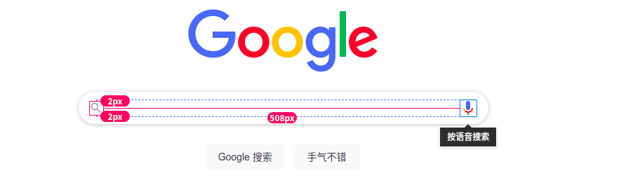
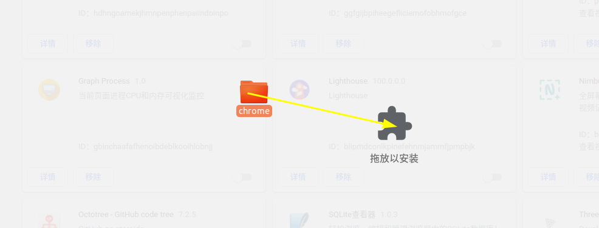
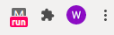
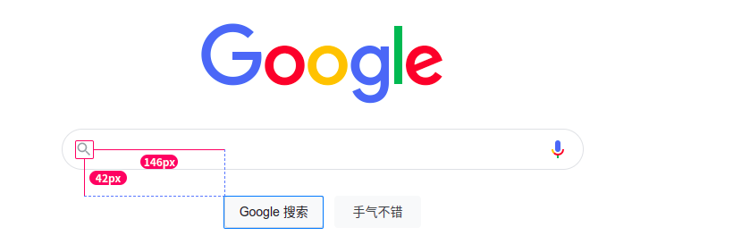
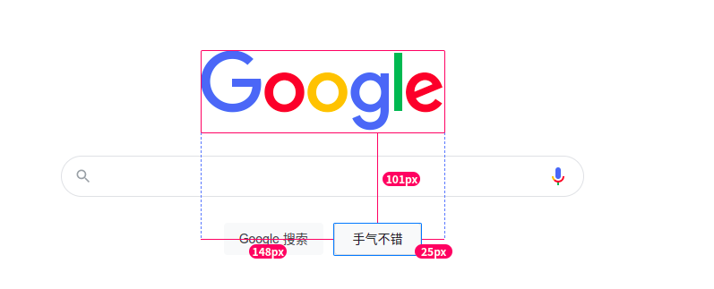

# Measure JS

A JavaScript tool designed to help develop more accurate and efficient restoration design, help designers more easily complete UI walkthroughs, help test earlier detection of problems.

Read this document in other languages: [English](README.md), [简体中文](README.zh-Hans.md).

## How to use

1. Move your mouse cursor to an element, and press <kbd>Alt</kbd> on Windows or <kbd>⌥ Option</kbd> on a Mac.

2. Move the mouse cursor to another element and the measurement results will be displayed.

## Special operation

Hold down with <kbd>Shift</kbd> key will delay the dismiss of measurement results, so that we can take a screenshot easier.

## Chrome Extension

Drag and drop the Chrome directory in your project into [Plug-in extension](chrome://extensions/)中. You can use it as a Chrome plugin

## demo

## Contribute

You are free to fork the repository and submit pull requests. Bug reports in [GitHub Issues](https://github.com/zhuweijian666/measure.js/issues).

## License

Spacing.js is [MIT Licensed](LICENSE).
