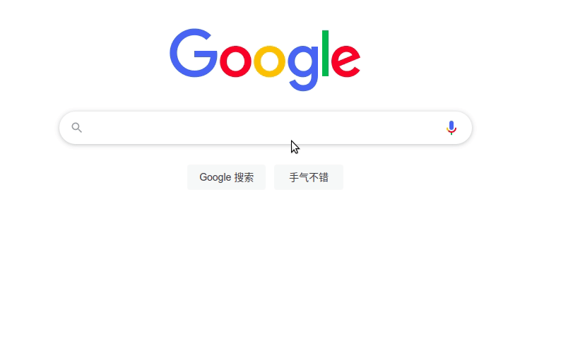
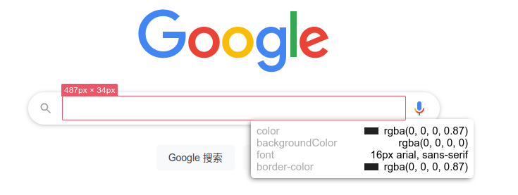

# Measure JS

一个 JavaScript 工具,原型参考蓝湖(离开蓝湖也能使用蓝湖),旨在帮助开发更精准高效的还原设计图,帮助设计师更方便的完成 UI 走查,帮助测试更早的测出问题.

阅读本文档的其他语言: [English](README.md), [简体中文](README.zh.md).

## 如何使用

1. 将鼠标光标移动到一个元素上，在 Windows 上按<kbd>Alt</kbd>或在 Mac 上按<kbd>⌥ Option</kbd>,会显示出选中元素的 cssViewer 面板.

2. 将鼠标光标移动到另一个元素，测量结果将会展示.

3. cssViewer 面板中，你可以输入色值（支持 rgba/16 进制格式）,最后按<kbd>Enter</kbd>让其生效

4. 点击 cssViewer 面板中色块区域，能让色值从 rgba 和 16 进制之间切换

## 特殊操作

1. 按下<kbd>Shift</kbd>键,将冻结测量结果，这样我们可以更容易地采取截图 。

2. 测量结果冻结后，按下<kbd>Alt</kbd>或在 Mac 上按<kbd>⌥ Option</kbd> 可解冻

## 温馨提示

如果有截图需要，又因为截图的快捷键包含 alt 键导致截图不了，解决方案如下：

1. 可以一直按照 alt 键，再去按其他按键去截图

2. 鼠标先点击下页面外面，让当前页面失焦，再去截图

## Chrome 插件

把项目中的 chrome 目录拖拽到[插件扩展](chrome://extensions/)中. 你可以把它当做 chrome 插件去用

## demo

## Contribute

您可以自由地 fork 这个存储库并提交 pull 请求。bug 报告在[GitHub Issues](https://github.com/weijian-zhu/measure.js/issues).

## License

Measure.js is [MIT Licensed](LICENSE).
